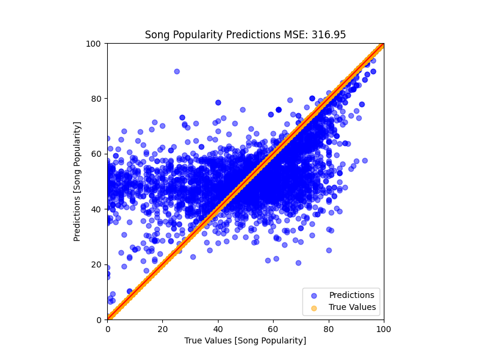

# Song Popularity Predictions

## Introduction

In order to better help friends and family find new music, I have decided to create a model that will predict the popularity of a song based on its audio features. Using the dataset `song_data.csv` from Spotify, I was able to create a model that predicts the popularity of a song based on its audio features. This is a useful model for helping artists and people predict how well their music will do as a streamable song.

## Data

The dataset used for this project was `song_data.csv` from Spotify. We are looking at 1 output, the song popularity, and 4 input variables (length, danceability, loudness, and tempo) over the 18836 songs. The data was split into 80% training and 20% testing.

## The Models

### Artificial Neural Network

This network was able to predict the popularity and had very little training loss , 0.048, and testing loss, 0.049. However, the model was not able to develop a shape that followed the actual data.

As you can see, the model clustered itself between popularities ofr 40 and 60, basically guessing the average values for each song. This is not a useful model, and after changing the number of nodes, layers, and activation functions, I was unable to get any significant shape improvement, leading me to switch models to a random forest.

### Random Forest

The random forest was significantly better than the ANN. Using this strategy the model was able to develop some semblance of shape and more closely follow the actual data. The model was able to predict the popularity of a song with an accuracy of 78%, with an MSE of 327.5.

The following images illustrate the gradual improvement of the model:

#### 1000 Trees

#### 2000 Trees

#### 3000 Trees

#### 2000 Trees with Depth of 40

#### 2000 Trees with Depth of 80
