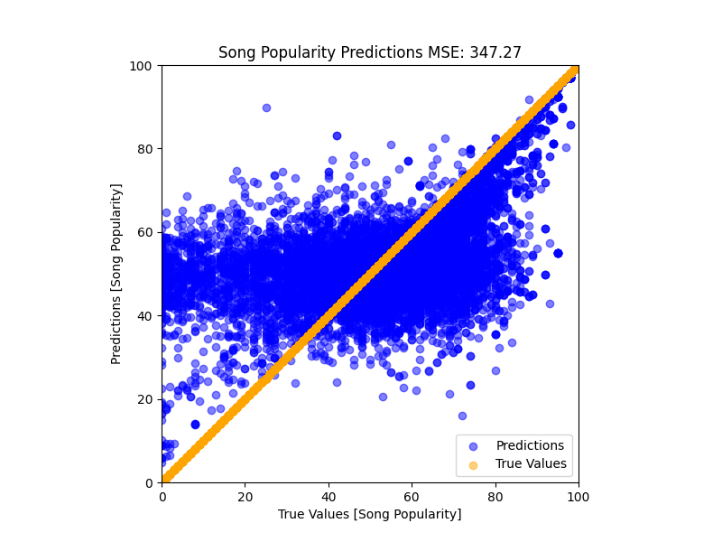

# Song Popularity Predictions

<!-- TODO: Go much more detailed into what a random forest is doing and how it works. Discuss why more estimations are not improving the overall picture. -->

## Introduction

In order to better help friends and family find new music, I have decided to create a model that will predict the popularity of a song based on its audio features. Using the dataset `song_data.csv` from Spotify, I was able to create a model that predicts the popularity of a song based on its audio features. This is a useful model for helping artists and people predict how well their music will do as a streamable song.

## Data

The dataset used for this project was `song_data.csv` from Spotify. We are looking at 1 output, the song popularity, and 4 input variables (length, danceability, loudness, and tempo) over the 18836 songs. The data was split into 80% training and 20% testing.

## How to Run

First, install the requirements using `pip install -r requirements.txt`. Then, run the `main.py` file. This will run the model and output the results to the console.

Next, run `python main.py`. This will run the model and output the results to the console.

## The Models

### Artificial Neural Network

This network was able to predict the popularity and had very little training loss , 0.048, and testing loss, 0.049. However, the model was not able to develop a shape that followed the actual data.


As you can see, the model clustered itself between popularities ofr 40 and 60, basically guessing the average values for each song. This is not a useful model, and after changing the number of nodes, layers, and activation functions, I was unable to get any significant shape improvement, leading me to switch models to a random forest.

The model itself looked like this:

```python
    model = tf.keras.Sequential(
        [
            tf.keras.layers.Dense(
                128,
                activation="relu",
                input_shape=(
                    [
                        X_train_scaled.shape[1],
                    ]
                ),
            ),
            tf.keras.layers.Dropout(0.2),
            tf.keras.layers.Dense(64, activation="relu"),
            tf.keras.layers.Dropout(0.2),
            tf.keras.layers.Dense(32, activation="relu"),
            tf.keras.layers.Dropout(0.2),
            tf.keras.layers.Dense(8, activation="relu"),
            tf.keras.layers.Dense(
                1
            ),  # Output layer, as we're predicting a single value (song popularity)
        ]
    )
```

Even adjusting down to fewer layers maintained the same general horizonal shape, finding a good average value, but not predicing a spedific song's popularity well.

### Random Forest

Random forest is an ensemble learning algorithm that uses a collection of decision trees to make predictions. Each decision tree is trained on a different subset of the data, and the predictions of all the trees are averaged to produce the final prediction. [(1)](https://www.analyticsvidhya.com/blog/2021/06/understanding-random-forest/#:~:text=Random%20forest%20is%20an%20ensemble,to%20produce%20the%20final%20prediction.)

The random forest was significantly better than the ANN. Using this strategy the model was able to develop some semblance of shape and more closely follow the actual data. The model was able to predict the popularity of a song with an MSE of 327.5.

While the shape is not ideal, looking more like an x^3 curve, than a linear prediciton, but it is much better than the ANN. The model was able to identify the general highs and lows for the values.

The following images illustrate the gradual improvement of the model:

#### 1000 Trees


#### 2000 Trees


#### 3000 Trees


#### 2000 Trees with Depth of 40


#### 2000 Trees with Depth of 50



This also used a smaller testing model, only 15 percent of the total rather than 20 percent. This was done to increase the number of trees that could be used in training. Notice how on this, the midsection between 40 and 60 is fatter, with more data points falling into that range.

#### 4000 Trees with Depth of 50


This model had worse accuracy than the 2000 tree model, with only 32% of results within 5 of the expected outcome and 53% within 10. This is likely due to overfitting of the trees to the dataset.
