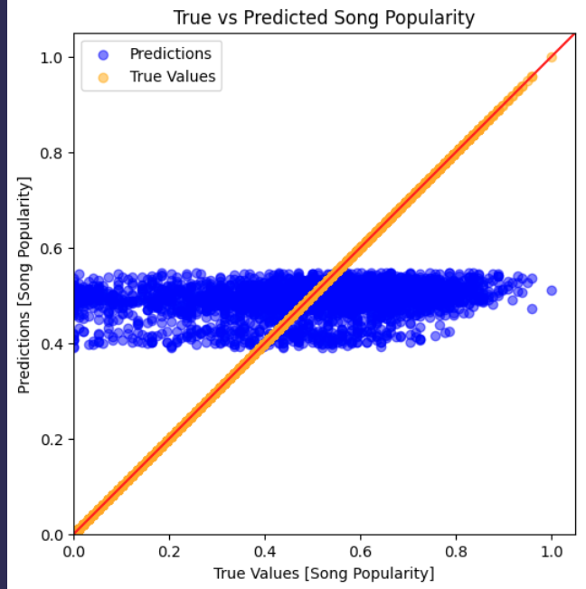
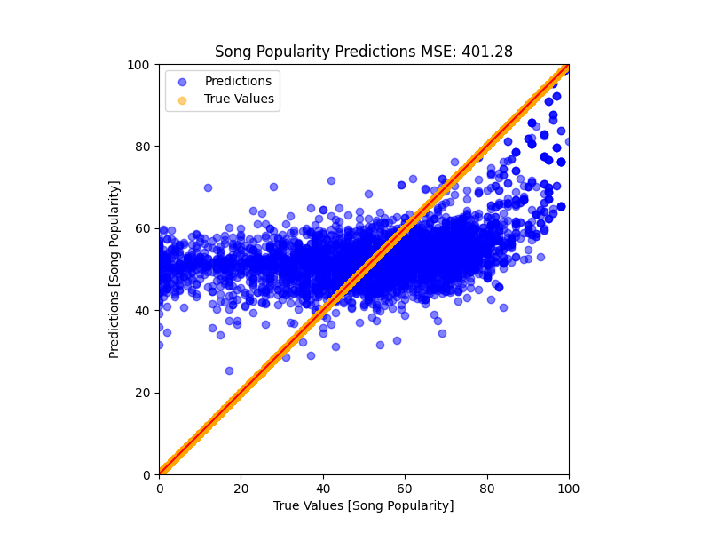
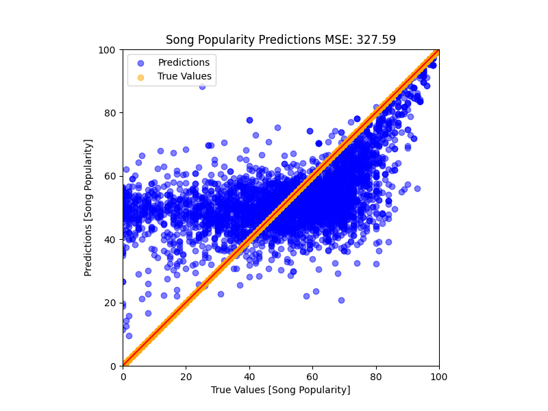
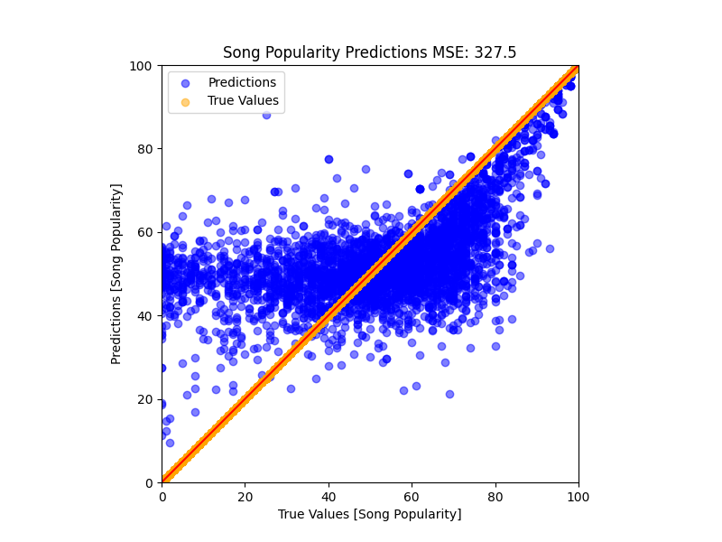
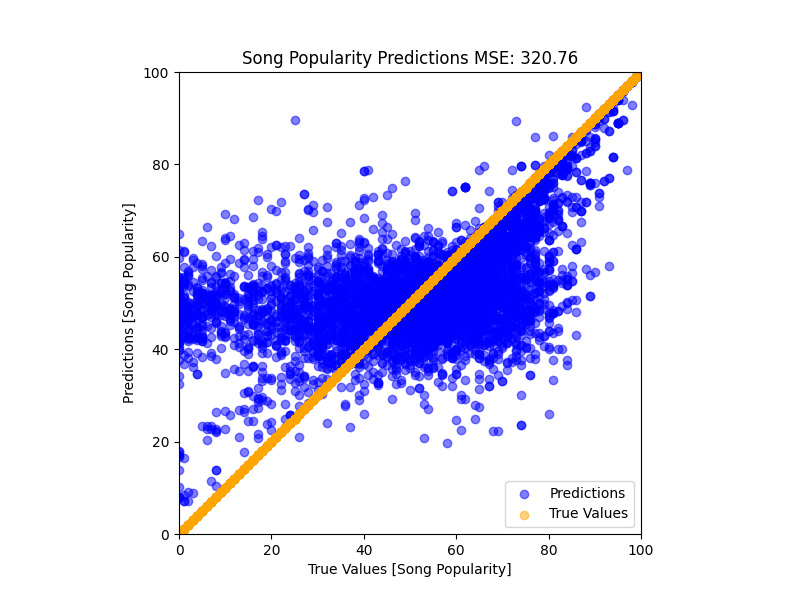
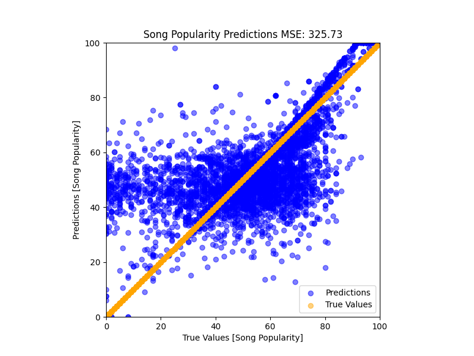
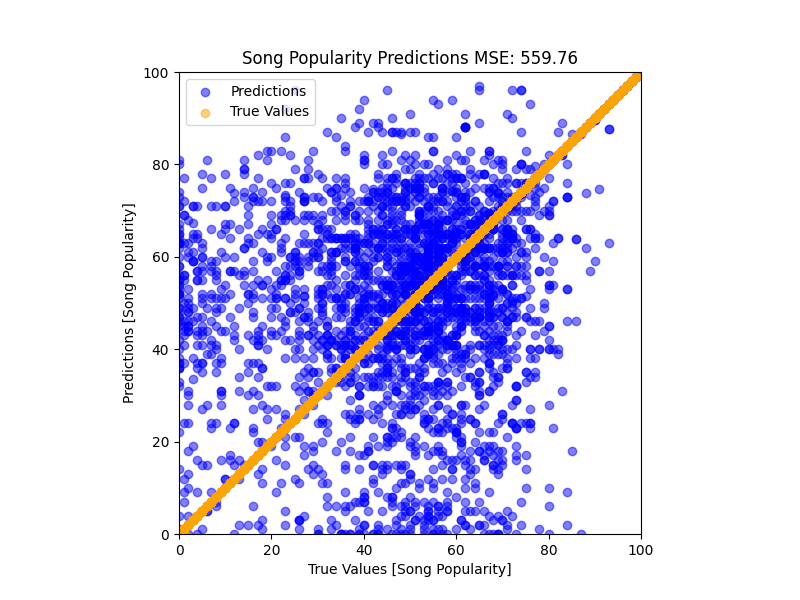

# Song Popularity Predictions

## Introduction

In order to better help friends and family find new music, I have decided to create a model that will predict the popularity of a song based on its audio features. Using the dataset `song_data.csv` from Spotify, I was able to create a model that predicts the popularity of a song based on its audio features. This is a useful model for helping artists and people predict how well their music will do as a streamable song.

## Data

The dataset used for this project was `song_data.csv` from Spotify. We are looking at 1 output, the song popularity, and 4 input variables (length, danceability, loudness, and tempo) over the 18836 songs. The data was split into 80% training and 20% testing.

## How to Run

First, install the requirements using `pip install -r requirements.txt`.

### Run the ANN

The ANN is in `ann.py` can be run by inputing `python ann.py`. This will run the training and output a model. If you would like to load the model and run it, you can change the variable `load` in `ann.py` to `True`, input the model you would like to run, and then run the file.

### Run the Random Forest

The random forest is in `random_forest.py` and can be run by inputing `python forest.py`. If you would like to load a model and run it, you can change the variable `load` in `forest.py` to `True`, add the filename you would like to read, and then run the python program.

## The Models

### Artificial Neural Network

This network was able to predict the popularity and had very little training loss , 0.048, and testing loss, 0.049. However, the model was not able to develop a shape that followed the actual data.



As you can see, the model clustered itself between popularities ofr 40 and 60, basically guessing the average values for each song. This is not a useful model, and after changing the number of nodes, layers, and activation functions, I was unable to get any significant shape improvement, leading me to switch models to a random forest.

The model itself looked like this:

```python
    model = tf.keras.Sequential(
        [
            tf.keras.layers.Dense(
                128,
                activation="relu",
                input_shape=(
                    [
                        X_train_scaled.shape[1],
                    ]
                ),
            ),
            tf.keras.layers.Dropout(0.2),
            tf.keras.layers.Dense(64, activation="relu"),
            tf.keras.layers.Dropout(0.2),
            tf.keras.layers.Dense(32, activation="relu"),
            tf.keras.layers.Dropout(0.2),
            tf.keras.layers.Dense(8, activation="relu"),
            tf.keras.layers.Dense(
                1
            ),  # Output layer, as we're predicting a single value (song popularity)
        ]
    )
```

Even adjusting down to fewer layers maintained the same general horizonal shape, finding a good average value, but not predicing a spedific song's popularity well.

The best output we were able to get from the ANN was:

```text
Accuracy within 5 popularity levels: 1.62%
Accuracy within 10 popularity levels: 3.53%
Accuracy within 25 popularity levels: 15.08%
Mean Squared Error:  2704.89
```

As you can see, the accuracy was very low, and the MSE was very high. This is not a useful model.

### Random Forest

Random forest is an ensemble learning algorithm that uses a collection of decision trees to make predictions. Each decision tree is trained on a different subset of the data, and the predictions of all the trees are averaged to produce the final prediction.

The random forest was significantly better than the ANN. Using this strategy the model was able to develop some semblance of shape and more closely follow the actual data. The model was able to predict the popularity of a song with an MSE of 327.5.

While the shape does not match the linear popularity well, it is closer than the ANN. The model was able to identify the general highs and lows for the values, but still wants to cluster around the average.

The following images illustrate the gradual improvement of the model:

#### 1000 Trees



Here we can see an improvement from the ANN, because of the trailing edge leading up towards the more popular values. However, the model is still predicting an inaccurate shape.

#### 2000 Trees



Running on 2000 trees the system had 32% of results within 5 of the expected outcome and 53% within 10. This is a significant improvement over the ANN. The tails are becoming strong as we increase the number of trees. The MSE is 327.6.

Accuracy within 5 popularity levels: 32.28%
Accuracy within 10 popularity levels: 53.2%
Accuracy within 25 popularity levels: 84.18%

#### 3000 Trees



Here we see the diminishing returns compared to 2000 trees. The MSE only improved by 0.1 and the shape is almost identical. The accuracy is almost the same with 33.98% of results within 5 of the expected outcome and 54.26% within 10.

#### 4000 Trees



This model had worse accuracy than the 2000 tree model, with only 32% of results within 5 of the expected outcome and 53% within 10. This is likely due to overfitting of the trees to the dataset. The MSE was 320.76, which is slightly better than the 2000 tree model.

Accuracy within 5 popularity levels: 34.11%
Accuracy within 10 popularity levels: 54.34%
Accuracy within 25 popularity levels: 84.9%

#### Random Forest with Linear Regression

This model took the output of the random forest, which had a shape similar to x^3, and ran it through a linear regression model. This was able to smooth out the curve and make it more linear. The MSE was 325, which is similar to the other models, but it does have a better shape, particularly in the tails.

Once again, not a great match, but it is better than the ANN.
Accuracy within 5 popularity levels: 31.72%
Accuracy within 10 popularity levels: 54.53%
Accuracy within 25 popularity levels: 83.81%

The overall accuracy within 5 popularity goes up 1-3% depending on the number of trees, but the overall accuracy within 10 and 25 goes down 1-2%. This is likely due to the linear regression smoothing out the curve and giving the model a more linear shape.



### CART (Classification and Regression Trees)

CART is a decision tree learning algorithm that uses a binary tree to split the data into smaller subsets. The algorithm uses a greedy approach to split the data into subsets that minimize the error. The algorithm is recursive, and continues to split the data until it reaches a stopping point.

The CART model was able to predict the popularity of a song with an MSE of 559.7. This is almost double the MSE of the random forest, and the shape itself is even further than the true output. It looks more like a scatter plot than a prediction curve. That being said, this model had the most accurate prediction within 5 popularity levels, with 41.28% of results within 5 of the expected outcome. This is a significant improvement (over 10%) compared to the random forest.



Accuracy within 5 popularity levels: 41.28%
Accuracy within 10 popularity levels: 52.27%
Accuracy within 25 popularity levels: 74.67%
Mean Squared Error: 559.76
